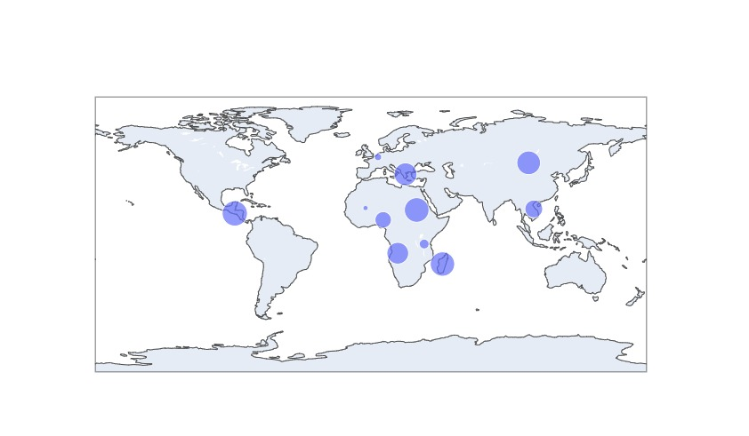

# Map With Dynamic Data

  

## Descrição 

É uma map criado usando a biblioteca DASH do python.
Esse mapa vai adicionando dados em tempo real no mapa.

<footer> Desevolvido por &copy;Wilson Rivero </footer>
